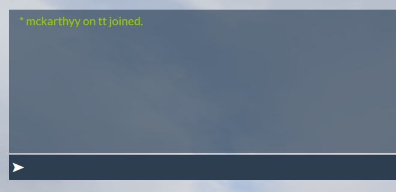

# Chat theme

**"I bought the chat and the default theme is still here"**

<figure><figcaption></figcaption></figure>

Do not panic, this is a simple fix. You will need to go the file paths listen below.

`server artfiacts/citizen/system_resources` and delete `chat.`

`resources/[cfx-default][gameplay]` and delete `chat` & `chat-theme-gtao`

After doing that, go to your server.cfg and search for `set resources_useSystemChat` and turn it to `false.`&#x20;

Follow this video if you still need help --> [Click here](https://r2.fivemanage.com/Swo6vGgMWPL7N9iV7eyMk/video/2024-09-13_21-50-46.mp4)

**"The chat has yellow lines on it"**

<figure><figcaption></figcaption></figure>

Again this is a simple-fix this should only be for ESX users.

Follow the file path.

`Resources/[core]/` and delete `esx_chat_theme`

If you followed all these steps and the chat theme still isn't working for you  feel free to make a ticket in the [discord](https://discord.gg/3jzknb7zq2) for more assistance.&#x20;
