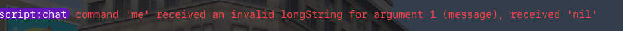

# Received an invalid string

If you see the error below, it doesn’t mean something is broken—it just means you’re using the command incorrectly.

For example, the `/me` command expects `/me [message]`, but in this scenario it only received `/me`

<figure><figcaption></figcaption></figure>

If you would like to change the error it gives you, you will need to go to:

`ox_lib/imports/addCommand/server.lua`

Then, replace lines 26–71 with the code below:

```
---@param source number
---@param args table
---@param raw string
---@param params OxCommandParams[]?
---@return table?
local function parseArguments(source, args, raw, params)
    if not params then return args end

    local paramsNum = #params
    for i = 1, paramsNum do
        local arg, param = args[i], params[i]
        local value

        if param.type == 'number' then
            value = tonumber(arg)
        elseif param.type == 'string' then
            value = not tonumber(arg) and arg
        elseif param.type == 'playerId' then
            value = arg == 'me' and source or tonumber(arg)

            if not value or not DoesPlayerExist(value--[[@as string]]) then
                value = false
            end
        elseif param.type == 'longString' and i == paramsNum then
            if arg then
                local start = raw:find(arg, 1, true)
                value = start and raw:sub(start)
            else
                value = nil
            end
        else
            value = arg
        end

        if not value and (not param.optional or param.optional and arg) then
            local data = {
                title = "Error",
                description = "Invalid usage received",  
                duration = 5000,
                type = 'error',
                position = 'top-right',
                icon = 'exclamation-circle',
                iconColor = '#ff0000',
                showDuration = true,
            }
            
            TriggerClientEvent('ox_lib:notify', source, data)

            return 
        end

        arg = value
        args[param.name] = arg
        args[i] = nil
    end

    return args
end
```

Now, instead of displaying an error print, it will alert them using ox\_lib telling them the command received invalid usage.
